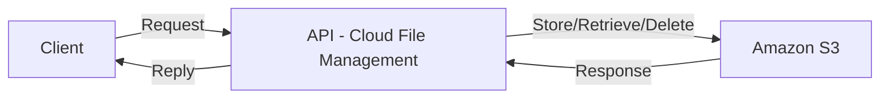

### [Leia isso em português](README.md)

# Cloud File Management

## 📌 About the Project

**Cloud File Management** is a REST API developed in **Java** with **Spring Boot**, designed to manage files stored in **Amazon S3**. The API allows **listing, uploading, downloading, and deleting** files securely, using hashing for integrity control and ensuring a robust structure for cloud storage management.

This project, as it stands, is not intended for production use but rather as a demonstration of how a cloud file management system works. However, the implemented mechanism can be incorporated into a larger project and adapted for use in a real professional environment.

Currently, the application is running on an **AWS EC2** instance, using **Docker** for execution.

## 🛠️ Technologies Used

- **Java 17**
- **Spring Boot 3**
- **Amazon S3 SDK**
- **Maven**
- **JUnit 5**
- **Mockito**
- **AWS EC2** (instance where the API is hosted)
- **Docker** (used to run the project inside the EC2 instance)

## 🚀 How to Use the Project

### 🔧 Prerequisites

To consume this API, I recommend using Postman or a similar tool:

- [Postman](https://www.postman.com/)

If you want to run the project locally with your own S3, you will also need:

- [JDK 17](https://www.oracle.com/java/technologies/javase/jdk17-archive-downloads.html)
- [Maven](https://maven.apache.org/)

## 📌 Main Endpoints

| Method  | Endpoint          | Description                     |
|---------|------------------|--------------------------------|
| **GET**  | `/api/list`     | Lists all files in the bucket |
| **POST** | `/api/upload`   | Uploads a file |
| **GET**  | `/api/download/{filename}` | Downloads a file |
| **DELETE** | `/api/delete/{filename}` | Deletes a file from S3 |

## 🌐 API Architecture

The API follows the structure below to manage files in the cloud:



## 🛠️ How to Test in Postman

### 🔹 List Files
- **Method:** `GET`
- **URL:** `http://56.125.18.57:8080/api/list`
- **Expected Response (example):**
  ```json
  [
    "document.pdf",
    "image.png",
    "report.docx"
  ]
  ```

### 🔹 Upload a File
- **Method:** `POST`
- **URL:** `http://56.125.18.57:8080/api/upload`
- **Body:**
  - Select `form-data`
  - Add a key named **file** and upload a local file
- **Expected Response (example):**
  ```
  Arquivo upado para o bucket com sucesso: 1739391218813-test.txt
  ```
---
### 🔹 Download a File
- **How to use:** Use the URL below and replace `file.txt` with the desired filename and its extension.
- **URL:** `http://56.125.18.57:8080/api/download/file.txt`
- **Result:** When entering the URL in the browser, the file will be downloaded automatically.
---
### 🔹 Delete a File
- **Method:** `DELETE`
- **How to use:** Use the URL below and replace `file.txt` with the desired filename and its extension.
- **URL:** `http://56.125.18.57:8080/api/delete/file.txt`
- **Expected Response (example):**
  ```
  Arquivo deletado com sucesso.
  ```

## 🧪 Tests  
The tests cover the logic of **hashing**, **S3 storage**, **file deletion**, **download**, and **file listing**, ensuring the integrity of operations.

## 📜 License

This project is distributed under the [MIT License](https://opensource.org/licenses/MIT).

---
📌 **Maintainer:** [Tiago Ledur](https://github.com/TiagoLedur)
