### [Read this in English](README-en.md)

# Cloud File Management

## 📌 Sobre o Projeto

O **Cloud File Management** é uma API REST desenvolvida em **Java** com **Spring Boot**, projetada para gerenciar arquivos armazenados no **Amazon S3**. A API permite **listagem, upload, download e exclusão** de arquivos de forma segura, utilizando hashing para controle de integridade e garantindo uma estrutura robusta para gerenciamento de armazenamento na nuvem. 

Este projeto, do jeito que está, não tem o intuito de ser utilizado em produção, mas sim como uma demonstração do funcionamento de um sistema de gerenciamento de arquivos em nuvem. No entanto, o mecanismo implementado pode ser incorporado em um projeto maior e adaptado para uso em um ambiente profissional real.

Atualmente, a aplicação está rodando em uma instância **AWS EC2**, utilizando **Docker** para sua execução.

## 🛠️ Tecnologias Utilizadas

- **Java 17**
- **Spring Boot 3**
- **Amazon S3 SDK**
- **Maven**
- **JUnit 5**
- **Mockito**
-  **AWS EC2** (instância onde a API está hospedada)
- **Docker** (utilizado para rodar o projeto dentro da instância EC2)

## 🚀 Como Consumir o Projeto

### 🔧 Pré-requisitos  

Para consumir essa API eu recomendo que use o Postman ou outra ferramenta parecida:  

- [Postman](https://www.postman.com/)  

Se quiser rodar o projeto localmente com um S3 próprio, você também precisará de:  

- [JDK 17](https://www.oracle.com/java/technologies/javase/jdk17-archive-downloads.html)  
- [Maven](https://maven.apache.org/)

## 📌 Endpoints Principais

| Método  | Endpoint          | Descrição                     |
|---------|------------------|------------------------------|
| **GET**  | `/api/list`     | Lista todos os arquivos do bucket |
| **POST** | `/api/upload`   | Faz o upload de um arquivo |
| **GET**  | `/api/download/{filename}` | Faz o download do arquivo |
| **DELETE** | `/api/delete/{filename}` | Exclui um arquivo do S3 |

## 🌐 Arquitetura da API

A API segue a estrutura abaixo para gerenciar arquivos na nuvem:

```mermaid
graph LR
    A[Cliente] -->|Requisição| B[API - Cloud File Management]
    B -->|Armazena/Recupera/Exclui| C[Amazon S3]
    C -->|Retorno| B
    B -->|Resposta| A
```



## 🛠️ Como Testar no Postman

### 🔹 Listar Arquivos
- **Método:** `GET`
- **URL:** `http://56.125.18.57:8080/api/list`
- **Resposta esperada (exemplo)**:
  ```json
  [
    "documento.pdf",
    "imagem.png",
    "relatorio.docx"
  ]
### 🔹 Fazer Upload de Arquivo
- **Método:** `POST`
- **URL:** `http://56.125.18.57:8080/api/upload`
- **Body:**
	-   Escolha `form-data`
	-   Adicione uma chave chamada **file** e carregue um arquivo local
- **Resposta esperada (exemplo)**:
  ``
Arquivo upado para o bucket com sucesso: 1739391218813-test.txt
``
---
### 🔹 Fazer Download de Arquivo
-  **Como usar:** Use a URL abaixo e substitua `arquivo.txt` pelo nome do arquivo desejado e a extensão do mesmo.
- **URL:** `http://56.125.18.57:8080/api/download/arquivo.txt`
- **Resultado**: Ao inserir a URL no navegador o arquivo será baixado automaticamente.
---
### 🔹 Excluir Arquivo
- **Método:** `DELETE`
-  **Como usar:** Use a URL abaixo e substitua `arquivo.txt` pelo nome do arquivo desejado e a extensão do mesmo.
- **URL:** `http://56.125.18.57:8080/api/delete/arquivo.txt`
- **Resposta esperada (exemplo)**:
  ``
Arquivo deletado com sucesso.
``

## 🧪 Testes  
Os testes cobrem a lógica de **hash**, **armazenamento no S3**,  **exclusão de arquivos**, **download** e **listagem de arquivos**, garantindo a integridade das operações.  

## 📜 Licença

Este projeto é distribuído sob a [Licença MIT](https://opensource.org/licenses/MIT).

---
📌 **Mantenedor:** [Tiago Ledur](https://github.com/TiagoLedur)

